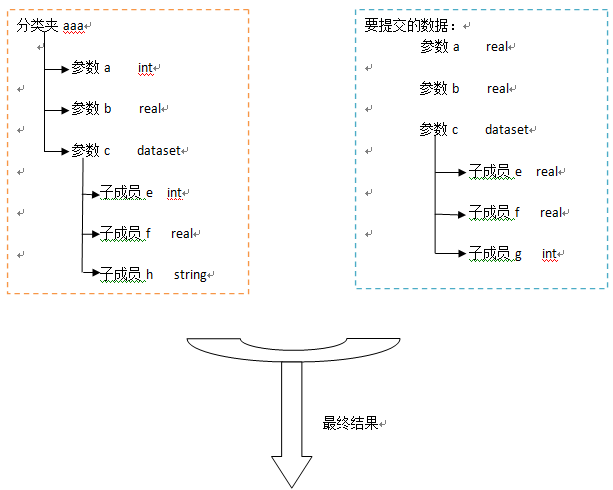
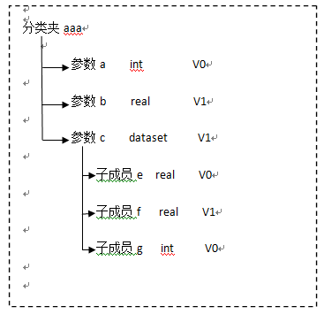

[TOC]


### 前提

1. 个人数据中心用于存储 IDE 个人数据 。
2. 文件类等单节点数据 的自动升版。文件夹类等复合节点数据 手动升版


### 存储原理

1. 个人数据中心里的数据 存储 在 P2M系统的 登录用户 的数据空间 中 。 原理为  PM_DATA_OBJECT 与 PM_DATA_OBJECT_OLD  , TASKID 属性 为 当前登录用户 的 loginId;

2. 在P2M 查看方式 ：在相应的oracle 数据库中执行下图sql ， 获取到 相应的用户Id  ;

   ```sql
   --eg  用 dxh 账户举例
   select u.user_Id from sys_user u where u.login_name = 'dxh'
   ```

   任意打开一条任务的任务数据界面，将 以下路径的 taskId，id，rootId 替换为 用户ID ，在浏览器中打开即可查看。

   ```html
   http://192.168.7.66:8015/sysware/task/grid/view/taskDataTreeGrid.simplemesh?navigationHandlerBeanName=singleMenuHandler&UUIDTOKEN=20180109165410000712f9fe215febb8472c94dd&taskId=100629E458334810A1F985520AA4C15A&id=100629E458334810A1F985520AA4C15A&rootId=100629E458334810A1F985520AA4C15A&currentMenuId=2-1-5-1
   ```

3.  因为在IDE 中 个人数据空间并不会展示  <span color=red>*</span> 号 , 所以在IDE 个人数据中心的数据处于 编辑状态，没有最新版本，可以在 2步骤中 个人数据中心 P2M 页面查看

 

### 个人数据空间发布到任务数据

   ws

```
DataObjectWebServiceImpl.publishDataStructure
```


1. 选择多条 个人数据空间数据  点击右键 发布到任务数据，会先进行导入数据验证 。

2. 数据的同名/同类型验证:对于选择的第一层数据，进行验证 ：

   <span color=red>IDE 导入数据 docx，word等类型为 FILE类型， 所有的xxx.docx等为 数据名称。
   同名同类型 也是指 File类型 与 参数（整型，实数等），名称为***.docx,***.txt 等。</span>

   | 是否可导入               | 类型     | 名称     |
   | ------------------------ | -------- | -------- |
   | 可以导入                 | 同类型   | 同名称   |
   | 可以导入                 | 不同类型 | 不同名称 |
   | 不可导入，会返回验证信息 | 不同类型 | 同名称   |

   

3. 父子数据导入需要验证，需要验证每一次数据的父子关系，按照任务数据模型关系配置。在P2M端修改了数据的模型关系后，需要清除IDE 的 CustomData 文件夹下的文件后，再重启IDE。

   

### 个人数据空间数据 导入数据处理规则 

ws

```
DataObjectWebServiceImpl.saveOrUpdateDataStructure
```

1 验证数据的同名/同类型验证:对于选择的第一层数据，

① 子集数据是否升版取决于该分类下对应的任务数据是否有同名同类型的数据，如果有则升版。 

② 原有的任务数据没有，提交的数据有，提交的数据作为新建。规则如下表

| 执行操作       | 类型     | 名称     |
| -------------- | -------- | -------- |
| 编辑           | 同类型   | 同名称   |
| 导入一条新数据 | 不同类型 | 不同名称 |
| 不执行导入     | 不同类型 | 同名称   |

2 验证数据的同名/同类型验证:对于选择的第二层及以下各层数据

① 子集数据是否升版取决于该分类下对应的任务数据是否有同名同类型的数据，如果有则升版，

② 同名不同类型的数据将原有任务数据删除，提交的数据作为新建。

③ 提交的任务数据中没有原有的数据，就将原有数据删除。

④ 原有的任务数据没有，提交的数据有，提交的数据作为新建。

规则如下表

|                                | 类型               | 个人数据 | 任务数据 |
| ------------------------------ | ------------------ | -------- | -------- |
| 删除                           | 同名同类型         | 无       | 有       |
| 编辑，升版本                   | 同名同类型         | 有       | 有       |
| 新建                           | 同名同类型         | 有       | 无       |
| 删除任务数据中，创建个人数据。 | 同名不同类型       | 有       | 有       |
| 新建                           | 不同名称，不同类型 | 有       | 无       |
| 删除                           | 不同名称，不同类型 | 无       | 有       |

 图例如下：



