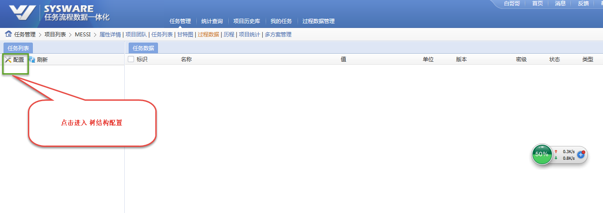
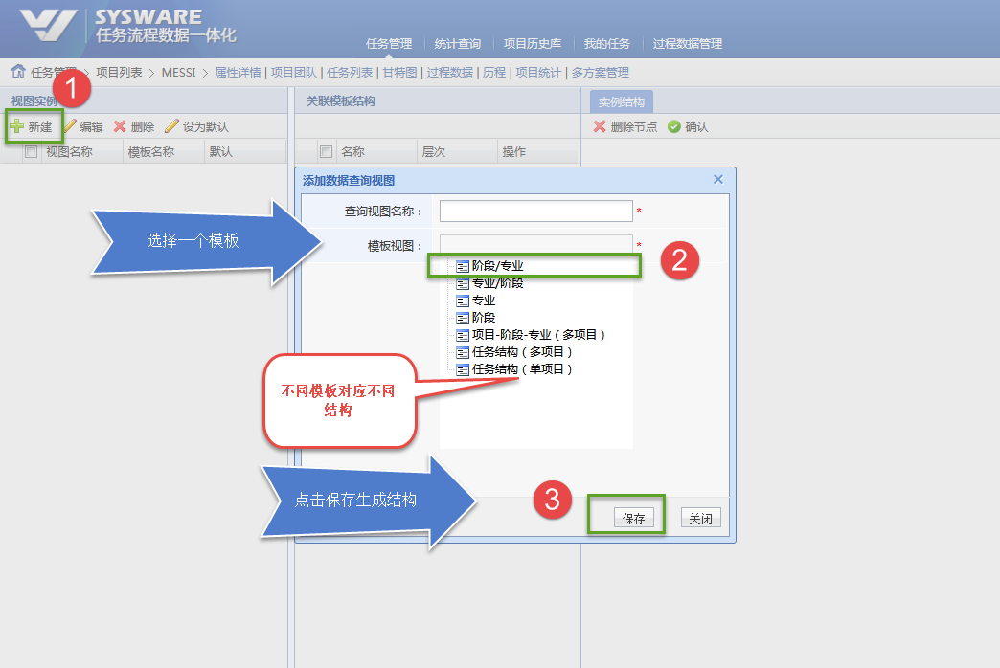
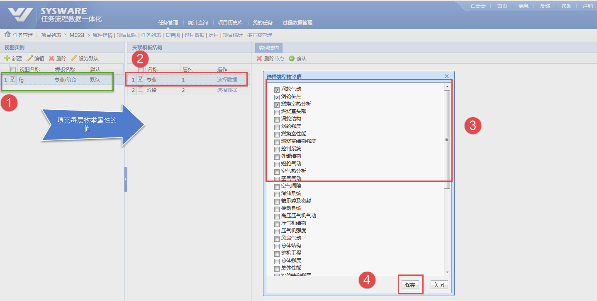
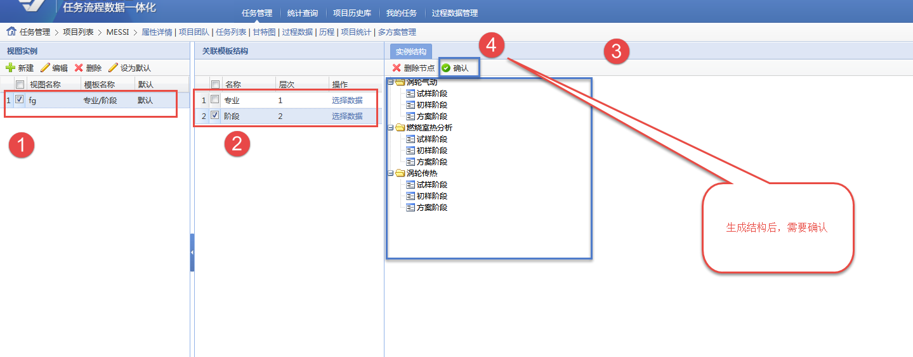

[TOC]


### 搜索视图左侧结构配置


##### 功能入口

```html
http://localhost:8080/task/data/productDataQueryViews/configMainView.simplemesh?navigationHandlerBeanName=singleMenuHandler&taskId=2018070316442700054217763115a86f4f99985d&rootId=2018070316442700054217763115a86f4f99985d&gridId=simpleProcessDataTreeGrid&currentMenuId=2-1-1-1&UUIDTOKEN=20180822095140000298abac53df3dd04fc192ec
```

或者 在 搜索视图， 多项目视图  点击  左上角 配置按钮 如下图




##### 操作步骤


1. 创建结构

   

2. 填充每层结构属性


​        


3. 生成结构，并裁剪 ，需要确认

   


   

##### 要点备注   

   

   模板的存放位置 process_data_template_view.xml 启动时读取。

   ```
   syswareFrameWork\com.sysware.p2m.configuration.default\task\process_data_template_view.xml
   ```

   

   ```xml
   <?xml version="1.0" encoding="UTF-8"?>
   
   <templates>
     <template id="20140828145400" name="阶段/专业">
       <node id="Phase" name="阶段" order="1"/>
       <node id="Specialty" name="专业" order="2"/>
     </template>
     <template id="SpecialtyPhase" name="专业/阶段">
       <node id="Specialty" name="专业" order="1"/>
       <node id="Phase" name="阶段" order="2"/>
     </template>
     <template id="Specialty" name="专业">
       <node id="Specialty" name="专业" order="1"/>
     </template>
     <template id="Phase" name="阶段">
       <node id="Phase" name="阶段" order="1"/>
     </template>
     <template id="Project-Phase-Specialty" name="项目-阶段-专业（多项目）">
       <node id="authorityProject" name="拥有权限项目" order="1"/>
       <node id="Phase" name="阶段" order="2"/>
       <node id="Specialty" name="专业" order="3"/>
     </template>
     <template id="Project-Task" name="任务结构（多项目）">
       <node id="authorityProject" name="拥有权限项目" order="1"/>
       <node id="task" name="任务" order="2"/>
     </template>
     <template id="SingleTask" name="任务结构（单项目）">
       <node id="singleTask" name="单一任务" order="1"/>
     </template>
   </templates>
   
   ```

有一些特殊模板只支持 多项目视图例如下图

| 项目-阶段-专业（多项目） | 多项目视图 |
| ------------------------ | ---------- |
| 任务结构（多项目）       | 多项目视图 |
|                          |            |
|                          |            |

