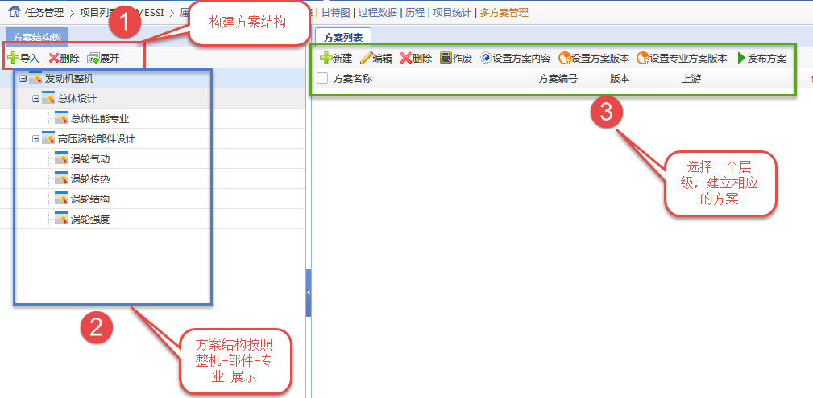
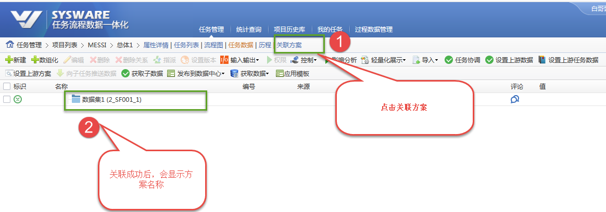
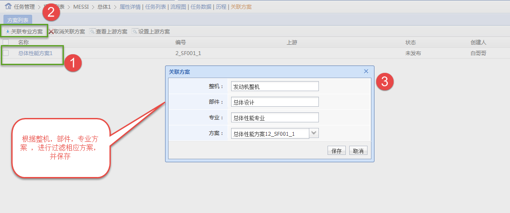
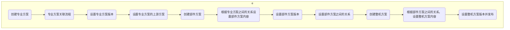

[TOC]


### 前提

1. 数据集开关打开

2. 多方案开关打开

3. 研发模板版本库开关打开

4. 相应包结构:

   ```
   P2M
    |_com.sysware.p2m.data
                          |_scheme （java 代码位置）
                          
    |_WebRoot
             |_p2m
                  |_scheme (页面位置)
                  
    |_com.sysware.p2m.configuration.default
    									|_task
    										  |_operation
                                    |_operation_definition_taskscheme.xml(操作配置)
   ```

   

5. 功能入口：

   ```html
   http://localhost:8080/sysware/task/grid/view/schemeTreeGrid.simplemesh?navigationHandlerBeanName=singleMenuHandler&UUIDTOKEN=201808201114000005734182b98e7d2f4de6adea&id=2018070316442700054217763115a86f4f99985d&taskId=2018070316442700054217763115a86f4f99985d&rootId=2018070316442700054217763115a86f4f99985d&currentMenuId=2-1-1-1&UUIDTOKEN=201808201114000005734182b98e7d2f4de6adea&currentMenuId=2-1-1-1
   ```

   

   

   

### 多方案业务含义

1.  我的理解为，整机，部件，专业方案 在 设计发动机的生命周期中，进行组织需求，产出物。
2.  更多业务问题，咨询田海源。


### 多方案编号

1.  方案的编号公式   参见代码：

   方案编号 = 方案的层级 （整机/部件/专业） + 方案结构节点的代号 + 方案结构节点下 顺序号

   ```java
   /**
   * TaskSchemeServiceImpl.getCompleteCode
   */ 
   private String getCompleteCode(String parentId, long levelType){
           //获取枚举节点
           String enumId = getSchemeEnumId(parentId);
           //生成中间代号
           String middleCode = getMiddleCode(enumId);
           String code = levelType+"_"+middleCode+"_"+getSortOrderByParentId(parentId);
           return code;
       }
   ```

   

   


### 多方案规则

1. 方案分为 整机，部件，专业方案。 方案之间的结构关系如下图。

   在专业方案层面，专业方案关联 任务流程。


   ```mermaid
   graph TD;
   
   subgraph 示例操作
    A("整机方案1") --> B("部件方案1") 
    A("整机方案1") --> C("部件方案2") 
    A("整机方案1") --> D("部件方案3") 
    B("部件方案1") --> B1("专业方案B1")
    B1("专业方案B1") --> P1("XX任务流程")
    B("部件方案1") --> B2("专业方案B2")
    B("部件方案1") --> B3("专业方案B3")
    C("部件方案2") --> C1("专业方案C1")
    C("部件方案2") --> C2("专业方案C2")
    C("部件方案2") --> C3("专业方案C3")
    end
   ```

   

2. 每一级方案，都是挂接在 多方案结构树上。如下图：

   方案结构树，需要按照导入 按钮的 枚举组合模板

   点击相应 方案结构，只能创建，维护相应的方案

   



3. 每个专业方案的会与 一个任务流程 一一对应，建立关联关系。在任务数据页面，点击[关联方案]后，关联一个方案， 然后对任务数据，进行发布，一个专业方案就与 任务数据建立联系。

   

   

    

4. 每一级方案内部，会根据研发模板之间的跨专业关系，设置 方案之间的关系。

5. 每一个上级方案，会选择若干个下级方案，作为本方案的做出，当然专业方案 ，需要用关联流程。 

6. 每一个方案的版本，都由设置下级方案的版本组成。通过 【设置方案版本】来实现。

### 使用逻辑


方案建立逻辑




专业方案与任务流程 关联逻辑

​    participant 1方案负责人
    participant 2流程负责人
    participant 3任务负责人


```mermaid
sequenceDiagram
    participant 1
    participant 2
    participant 3
      loop 在流程生命周期内，无限循环
     Note left of 1: 方案负责人1 <br/> 建立好方案结构
  
     Note left of 2: 流程负责人2 <br/> 根据大小阶段<br/>/整机/部件/专业<br/>实例化流程模板
     
      Note right of 3: 任务负责人2 <br/> 对当前任务数据 <br/>根据研发模板数据关系<br/>设置上游数据
      
      2 ->> 3 : 流程责任人  根据大小阶段/整机/部件/专业实例化流程模板
      2 ->> 1 : 流程责任人 在关联方案页面 关联 专业方案
      3 ->> 1 : 任务责任人 发布一个数据集，将 数据集版本 加入 专业方案 版本池
      3 ->> 1 : 任务责任人 对当前任务数据，设置上游数据。
      2 ->> 1 : 流程责任人 设置当前方案的上游方案。
      1 -->> 3 : 方案负责人 设置一个专业方案的版本
      3 ->> 2 : 根据专业方案之间关系，流程之间的关系，获取上游数据（包含多方案）
      3 ->> 1 : 发布一个数据集版本，加入专业方案池
       
       
    end
 
```


