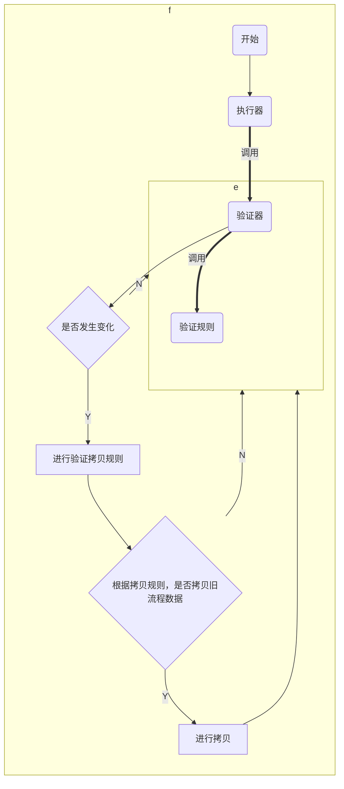

[TOC]


### 主旨

1. 此文档为同目录下 田海源编写 的《任务流程升级场景及用例.docx》 的补充。<span style="color:red"> 请务必阅读设计方案</span>

   


### 实现方案

1. #### 页面功能入口

   #### 流程图中，左上角 【流程切版】 按钮，主线，里程碑等已删除该入口。只有商发项目分支保留

2. #### 代码位置

   ```xml
       <operation id="task/operation/switchedProcess" name="切换研发流程模板" value="2" idProperty="targetTaskId">
           <before-event>
               <bean>copyParentTask</bean>
           </before-event>
           <around-event>
               <bean>copyStartedProcessTemplate</bean>
           </around-event>
           <after-event>
               <bean>mixedStartedProcess</bean>
               <bean>displaceSubProcess</bean>
           </after-event>
       </operation>
   ```

3. #### 代码逻辑

   ```mermaid
   graph TD;
   subgraph 流程升版逻辑
   A("选中流程A ")-->B("复制流程A为B copyParentTask")
   B("复制流程A为B copyParentTask") --> C("将A流程模板 在 B任务实例化一份 copyStartedProcessTemplate")
   C("将A流程模板 在 B任务实例化一份 copyStartedProcessTemplate") --> D("深度遍历处理B流程中的每一个节点 mixedStartedProcess")
   D("深度遍历处理B流程中的每一个节点 mixedStartedProcess") --> E("将A任务与B任务进行置换 displaceSubProcess")
   E("将A任务与B任务进行置换 displaceSubProcess") --> F("将A变为已终止")
   end
   ```

4. #### 核心代码

   ```java
    /**
        * 描述 : TODO 遍历嵌套流程，循环验证ACTIVTIY , 满足条件进行升级。不满足条件进行重置
        * @since : 2016/12/7 15:36
        * @author : P2M.tengwj
        */
       public void travelNode(Activity current,
                              Map<String,Boolean> list,
                              String rootTaskId,Map<String, String> tamap,
                              Map<String, String> nomap,
                              Map<String, String> anomap){
           ...
       }
   ```

5. 流程中每个节点判断逻辑

   验证规则：

   | 验证规则                      | 描述                               |
   | ----------------------------- | ---------------------------------- |
   | validateAvctiveTemplate       | 验证活动模板是否变化               |
   | validateEngineTemplate        | 验证活动模板对应的工程模板是否变化 |
   | validateJudgeExpressions      | 验证判断节点表达式是否变化         |
   | validateTemplateDataRelations | 验证研发活动模板数据关系是否变化   |

验证器：


| 验证器             | 需要验证规则                                                 | 描述                 |
| ------------------ | ------------------------------------------------------------ | -------------------- |
| mixedTask          | validateAvctiveTemplate，validateEngineTemplate，validateTemplateDataRelations | 验证流程图中任务节点 |
| mixedActivity      | validateTemplateDataRelations                                | 审核节点             |
| mixedJudgeActivity | validateJudgeExpressions，validateTemplateDataRelations      | 判断节点             |


执行器： mixedCase


拷贝规则 ：

| 类型     |                                                           |                |
| -------- | --------------------------------------------------------- | -------------- |
| 任务     | 满足 已完成，进行中                                       | true：进行复制 |
| 判断节点 | 通过新旧流程位置对比，表达式没有变化，按照 表达式判断结果 | true：进行复制 |
| 审核节点 | 通过新旧流程位置对比 ，复制审核节点数据                   | true：进行复制 |




