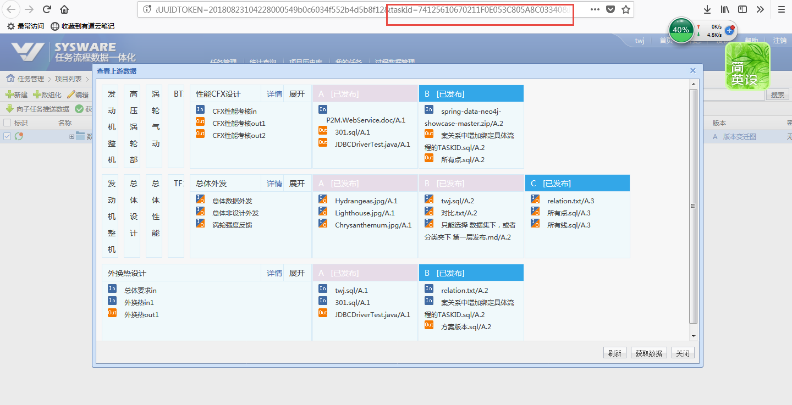
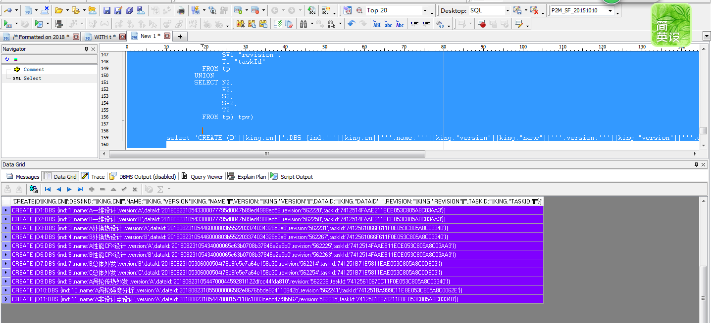
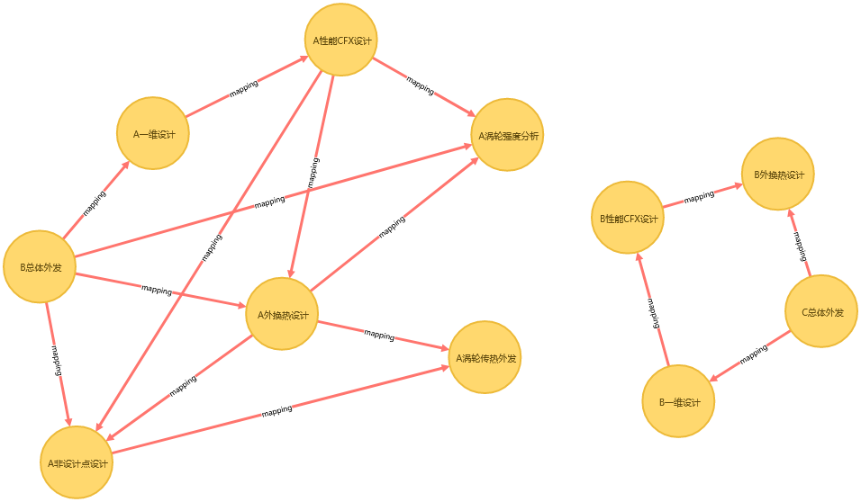

### 成套性检查方法


##### 工具

1. sqldeveloper；

2. neo4j

   

##### 简介

1. 真实开发环境，一个项目下可能有5000+以上任务，无法用肉眼观看哪些数据集是否成套。
2. 借用neo4j ，cypher 语言查询 数据集之间是否关联。

##### 实验素材

```html
<!-- 获取成套性实验页面 -->
http://192.168.5.100:8082/sysware/task/grid/view/taskDataTreeGrid.simplemesh?navigationHandlerBeanName=singleMenuHandler&UUIDTOKEN=20180823104228000549b0c6034f552b4d5b8f12&taskId=74125610670211F0E053C805A8C03340&id=74125610670211F0E053C805A8C03340&UUIDTOKEN=20180823104228000549b0c6034f552b4d5b8f12&rootId=74125610670211F0E053C805A8C03340&currentMenuId=2-1-1-1&UUIDTOKEN=20180823104228000549b0c6034f552b4d5b8f12

<!--  twj/123456  -->
```


##### 步骤

1 判断哪个任务节点，成套性有问题，记录有问题的taskId。




2 执行 成套性检查，核心脚本 sql，在 192.168.5.200:1521/sysware  P2M_SF_20151010/P2M_SF_20151010   数据库中，抓取数据集历史关系数据。将sql 执行结果 在下一步执行




3 生成 neo4j 脚本，在Neo4j 执行 生成 数据集传递关系图。


##### 成套性实例





如上图，可以看出 一维设计 的B版本 与 总体外发 的B版本 不存在关系


##### 核心脚本

```sql
/* 获取项目内所有节点 */
/* Formatted on 2018/8/23 13:43:27 (QP5 v5.227.12220.39754) */
WITH t
     AS (SELECT tag.id AS id
           FROM pm_Task_object tag
          WHERE tag.projectId IN
                   (SELECT et.projectid
                      FROM pm_task_object et
                     WHERE et.id = :taskId
                    UNION
                    SELECT eb.projectid
                      FROM pm_task_object eb
                     WHERE eb.subprocessid IN
                              (SELECT a.process_id
                                 FROM engine_activity a
                                WHERE a.activity_id = :taskId))),
     v
     AS (SELECT r.activity_data_relation_id AS rid,
                fac.action_id AS srcId,
                fac.action_name AS srcName,
                ta.activity_id AS targetId,
                ta.activity_name AS targetName
           FROM engine_activity_data_relation r
                LEFT JOIN engine_activity fa
                   ON r.from_activity_id = fa.activity_id
                LEFT JOIN engine_activity_action fac
                   ON fa.activity_id = fac.activity_id
                LEFT JOIN engine_activity ta
                   ON r.to_activity_id = ta.activity_id
          WHERE     r.relationtype = 'DATA'
                AND fa.activity_type = 'TASK_ACTIVITY'
                AND Ta.activity_type <> 'TASK_ACTIVITY'
                AND Ta.activity_type <> 'END_ACTIVITY'
                AND fac.action_id IN (SELECT t.id FROM t)
         UNION
         SELECT r.activity_data_relation_id AS rid,
                fa.activity_id AS srcId,
                fa.activity_name AS srcName,
                tac.action_id AS targetId,
                tac.action_name AS targetName
           FROM engine_activity_data_relation r
                LEFT JOIN engine_activity fa
                   ON r.from_activity_id = fa.activity_id
                LEFT JOIN engine_activity ta
                   ON r.to_activity_id = ta.activity_id
                LEFT JOIN engine_activity_action tac
                   ON ta.activity_id = tac.activity_id
          WHERE     r.relationtype = 'DATA'
                AND fa.activity_type <> 'TASK_ACTIVITY'
                AND Ta.activity_type = 'TASK_ACTIVITY'
                AND tac.action_id IN (SELECT t.id FROM t)
         UNION
         SELECT r.activity_data_relation_id AS rid,
                fac.action_id AS srcId,
                fac.action_name AS srcName,
                tac.action_id AS targetId,
                tac.action_name AS targetName
           FROM engine_activity_data_relation r
                LEFT JOIN engine_activity fa
                   ON r.from_activity_id = fa.activity_id
                LEFT JOIN engine_activity_action fac
                   ON fa.activity_id = fac.activity_id
                LEFT JOIN engine_activity ta
                   ON r.to_activity_id = ta.activity_id
                LEFT JOIN engine_activity_action tac
                   ON ta.activity_id = tac.activity_id
          WHERE     NVL (fac.action_id, '0') <> '0'
                AND NVL (tac.action_id, '0') <> '0'
                AND r.relationtype = 'DATA'
                AND fa.activity_type = 'TASK_ACTIVITY'
                AND Ta.activity_type = 'TASK_ACTIVITY'
                AND tac.action_id IN (SELECT t.id FROM t)
         UNION
         SELECT aso.relationid AS rid,
                aso.srctaskid AS srcId,
                ftc.name AS srcName,
                aso.targettaskid AS targetId,
                ttc.name AS targetName
           FROM pm_task_association aso
                LEFT JOIN pm_task_object ftc ON aso.srctaskid = ftc.id
                LEFT JOIN pm_task_object ttc ON aso.targettaskid = ttc.id
          WHERE aso.targettaskid IN (SELECT t.id FROM t)
         UNION
         SELECT r.activity_data_relation_id AS rid,
                ta.id AS srcId,
                ta.name AS srcName,
                fac.action_id AS targetId,
                fac.action_name AS targetName
           FROM engine_activity_data_relation r
                LEFT JOIN engine_process pb
                   ON R.FROM_ACTIVITY_ID = Pb.start_NODE_ID
                LEFT JOIN engine_activity_action fac
                   ON R.to_ACTIVITY_ID = fac.activity_id
                LEFT JOIN pm_task_object ta
                   ON TA.SUBPROCESSID = pb.process_id
          WHERE     NVL (pb.process_id, '0') <> '0'
                AND r.relationtype = 'DATA'
                AND ta.id IN (SELECT t.id FROM t)),
     AIP
     AS (SELECT evt.srcid id
           FROM (SELECT v.*,
                        (SELECT COUNT (*)
                           FROM v v3
                          WHERE v3.targetid = v.srcid)
                           cn
                   FROM v) evt
         UNION
         SELECT evt.targetid id
           FROM (SELECT v.*,
                        (SELECT COUNT (*)
                           FROM v v3
                          WHERE v3.targetid = v.srcid)
                           cn
                   FROM v) evt),
     PT
     AS (SELECT D.ID
           FROM PM_DATA_OBJECT D
          WHERE D.DEFAULTSET = 1 AND (d.taskId IN (SELECT AIP.ID FROM AIP))),
     TP
     AS (SELECT TA.NAME N1,
                AD.VERSIONNAME V1,
                A.SRCID S1,
                A.Srcrevision SV1,
                AD.TASKID T1,
                TB.NAME N2,
                BD.VERSIONNAME V2,
                A.TARGETID S2,
                A.TARGETREVISION SV2,
                BD.TASKID T2
           FROM pm_association_relation_old a
                LEFT JOIN pm_Data_object_old ad
                   ON a.srcid = ad.id AND a.srcrevision = ad.revision
                LEFT JOIN PM_TASK_OBJECT TA ON AD.TASKID = TA.ID
                LEFT JOIN pm_Data_object_old bd
                   ON a.targetid = bd.id AND a.targetrevision = bd.revision
                LEFT JOIN PM_TASK_OBJECT TB ON BD.TASKID = TB.ID
          WHERE     a.description IN ('1', '3')
                AND a.srcid IN (SELECT ID FROM PT)
                AND a.targetid IN (SELECT ID FROM PT)
                AND (   ad.statusid IN ('published')
                     OR ad.sharestatusid IN ('shared')
                     OR (ad.statusid IN ('confirmed')))),
     king
     AS (SELECT ROWNUM cn, tpv.*
           FROM (SELECT N1 "name",
                        V1 "version",
                        S1 "dataId",
                        SV1 "revision",
                        T1 "taskId"
                   FROM tp
                 UNION
                 SELECT N2,
                        V2,
                        S2,
                        SV2,
                        T2
                   FROM tp) tpv)
                   
                   
          select 'CREATE (D'||king.cn||':DBS {ind:'''||king.cn||''',name:'''||king."version"||king."name"||''',version:'''||king."version"||''',dataId:'''||king."dataId"||''',revision:'''||king."revision"||''',taskId:'''||king."taskId"||'''})' from king;         
          
```

```sql
/* 项目内所有节点关系  */
/* Formatted on 2018/8/23 13:43:27 (QP5 v5.227.12220.39754) */
WITH t
     AS (SELECT tag.id AS id
           FROM pm_Task_object tag
          WHERE tag.projectId IN
                   (SELECT et.projectid
                      FROM pm_task_object et
                     WHERE et.id = :taskId
                    UNION
                    SELECT eb.projectid
                      FROM pm_task_object eb
                     WHERE eb.subprocessid IN
                              (SELECT a.process_id
                                 FROM engine_activity a
                                WHERE a.activity_id = :taskId))),
     v
     AS (SELECT r.activity_data_relation_id AS rid,
                fac.action_id AS srcId,
                fac.action_name AS srcName,
                ta.activity_id AS targetId,
                ta.activity_name AS targetName
           FROM engine_activity_data_relation r
                LEFT JOIN engine_activity fa
                   ON r.from_activity_id = fa.activity_id
                LEFT JOIN engine_activity_action fac
                   ON fa.activity_id = fac.activity_id
                LEFT JOIN engine_activity ta
                   ON r.to_activity_id = ta.activity_id
          WHERE     r.relationtype = 'DATA'
                AND fa.activity_type = 'TASK_ACTIVITY'
                AND Ta.activity_type <> 'TASK_ACTIVITY'
                AND Ta.activity_type <> 'END_ACTIVITY'
                AND fac.action_id IN (SELECT t.id FROM t)
         UNION
         SELECT r.activity_data_relation_id AS rid,
                fa.activity_id AS srcId,
                fa.activity_name AS srcName,
                tac.action_id AS targetId,
                tac.action_name AS targetName
           FROM engine_activity_data_relation r
                LEFT JOIN engine_activity fa
                   ON r.from_activity_id = fa.activity_id
                LEFT JOIN engine_activity ta
                   ON r.to_activity_id = ta.activity_id
                LEFT JOIN engine_activity_action tac
                   ON ta.activity_id = tac.activity_id
          WHERE     r.relationtype = 'DATA'
                AND fa.activity_type <> 'TASK_ACTIVITY'
                AND Ta.activity_type = 'TASK_ACTIVITY'
                AND tac.action_id IN (SELECT t.id FROM t)
         UNION
         SELECT r.activity_data_relation_id AS rid,
                fac.action_id AS srcId,
                fac.action_name AS srcName,
                tac.action_id AS targetId,
                tac.action_name AS targetName
           FROM engine_activity_data_relation r
                LEFT JOIN engine_activity fa
                   ON r.from_activity_id = fa.activity_id
                LEFT JOIN engine_activity_action fac
                   ON fa.activity_id = fac.activity_id
                LEFT JOIN engine_activity ta
                   ON r.to_activity_id = ta.activity_id
                LEFT JOIN engine_activity_action tac
                   ON ta.activity_id = tac.activity_id
          WHERE     NVL (fac.action_id, '0') <> '0'
                AND NVL (tac.action_id, '0') <> '0'
                AND r.relationtype = 'DATA'
                AND fa.activity_type = 'TASK_ACTIVITY'
                AND Ta.activity_type = 'TASK_ACTIVITY'
                AND tac.action_id IN (SELECT t.id FROM t)
         UNION
         SELECT aso.relationid AS rid,
                aso.srctaskid AS srcId,
                ftc.name AS srcName,
                aso.targettaskid AS targetId,
                ttc.name AS targetName
           FROM pm_task_association aso
                LEFT JOIN pm_task_object ftc ON aso.srctaskid = ftc.id
                LEFT JOIN pm_task_object ttc ON aso.targettaskid = ttc.id
          WHERE aso.targettaskid IN (SELECT t.id FROM t)
         UNION
         SELECT r.activity_data_relation_id AS rid,
                ta.id AS srcId,
                ta.name AS srcName,
                fac.action_id AS targetId,
                fac.action_name AS targetName
           FROM engine_activity_data_relation r
                LEFT JOIN engine_process pb
                   ON R.FROM_ACTIVITY_ID = Pb.start_NODE_ID
                LEFT JOIN engine_activity_action fac
                   ON R.to_ACTIVITY_ID = fac.activity_id
                LEFT JOIN pm_task_object ta
                   ON TA.SUBPROCESSID = pb.process_id
          WHERE     NVL (pb.process_id, '0') <> '0'
                AND r.relationtype = 'DATA'
                AND ta.id IN (SELECT t.id FROM t)),
     AIP
     AS (SELECT evt.srcid id
           FROM (SELECT v.*,
                        (SELECT COUNT (*)
                           FROM v v3
                          WHERE v3.targetid = v.srcid)
                           cn
                   FROM v) evt
         UNION
         SELECT evt.targetid id
           FROM (SELECT v.*,
                        (SELECT COUNT (*)
                           FROM v v3
                          WHERE v3.targetid = v.srcid)
                           cn
                   FROM v) evt),
     PT
     AS (SELECT D.ID
           FROM PM_DATA_OBJECT D
          WHERE D.DEFAULTSET = 1 AND (d.taskId IN (SELECT AIP.ID FROM AIP))),
     TP
     AS (SELECT TA.NAME N1,
                AD.VERSIONNAME V1,
                A.SRCID S1,
                A.Srcrevision SV1,
                AD.TASKID T1,
                TB.NAME N2,
                BD.VERSIONNAME V2,
                A.TARGETID S2,
                A.TARGETREVISION SV2,
                BD.TASKID T2
           FROM pm_association_relation_old a
                LEFT JOIN pm_Data_object_old ad
                   ON a.srcid = ad.id AND a.srcrevision = ad.revision
                LEFT JOIN PM_TASK_OBJECT TA ON AD.TASKID = TA.ID
                LEFT JOIN pm_Data_object_old bd
                   ON a.targetid = bd.id AND a.targetrevision = bd.revision
                LEFT JOIN PM_TASK_OBJECT TB ON BD.TASKID = TB.ID
          WHERE     a.description IN ('1', '3')
                AND a.srcid IN (SELECT ID FROM PT)
                AND a.targetid IN (SELECT ID FROM PT)
                AND (   ad.statusid IN ('published')
                     OR ad.sharestatusid IN ('shared')
                     OR (ad.statusid IN ('confirmed')))),
     king
     AS (SELECT ROWNUM cn, tpv.*
           FROM (SELECT N1 "name",
                        V1 "version",
                        S1 "dataId",
                        SV1 "revision",
                        T1 "taskId"
                   FROM tp
                 UNION
                 SELECT N2,
                        V2,
                        S2,
                        SV2,
                        T2
                   FROM tp) tpv)
                   
                   
      --    select 'CREATE (D'||king.cn||':DBS {ind:'||king.cn||',name:'||king."version"||king."name"||',version:'||king."version"||',dataId:'||king."dataId"||',revision:'||king."revision"||',taskId:'||king."taskId"||'})' from king;         
                   
, keaf as (SELECT (SELECT king.cn
          FROM king
         WHERE king."dataId" = tp.s1 AND king."revision" = tp.sv1)
          s,
       (SELECT king.cn
          FROM king
         WHERE king."dataId" = tp.s2 AND king."revision" = tp.sv2)
          e
  FROM tp )
  
  select 'CREATE (D'||keaf.s||')-[:mapping]->(D'||keaf.e||')' from keaf;
```


##### 实例生成neo4j脚本

```cypher
CREATE (D1:DBS {ind:'1',name:'A一维设计',version:'A',dataId:'2018082310543300077795d0047b89ed4988ad59',revision:'562220',taskId:'7412514FAAE211ECE053C805A8C03AA3'})
CREATE (D2:DBS {ind:'2',name:'B一维设计',version:'B',dataId:'2018082310543300077795d0047b89ed4988ad59',revision:'562258',taskId:'7412514FAAE211ECE053C805A8C03AA3'})
CREATE (D3:DBS {ind:'3',name:'A外换热设计',version:'A',dataId:'20180823105446000803b552203374034326b3e6',revision:'562231',taskId:'7412561066F611F0E053C805A8C03340'})
CREATE (D4:DBS {ind:'4',name:'B外换热设计',version:'B',dataId:'20180823105446000803b552203374034326b3e6',revision:'562267',taskId:'7412561066F611F0E053C805A8C03340'})
CREATE (D5:DBS {ind:'5',name:'A性能CFX设计',version:'A',dataId:'20180823105434000065c63b0708b37846a2a5b0',revision:'562225',taskId:'7412514FAAEB11ECE053C805A8C03AA3'})
CREATE (D6:DBS {ind:'6',name:'B性能CFX设计',version:'B',dataId:'20180823105434000065c63b0708b37846a2a5b0',revision:'562263',taskId:'7412514FAAEB11ECE053C805A8C03AA3'})
CREATE (D7:DBS {ind:'7',name:'B总体外发',version:'B',dataId:'20180823105306000504f79d9fe5e7a64c158c30',revision:'562214',taskId:'741251B71E5811EAE053C805A8C0D903'})
CREATE (D8:DBS {ind:'8',name:'C总体外发',version:'C',dataId:'20180823105306000504f79d9fe5e7a64c158c30',revision:'562254',taskId:'741251B71E5811EAE053C805A8C0D903'})
CREATE (D9:DBS {ind:'9',name:'A涡轮传热外发',version:'A',dataId:'201808231054470004459281f122dfcc44fda810',revision:'562238',taskId:'74125610670C11F0E053C805A8C03340'})
CREATE (D10:DBS {ind:'10',name:'A涡轮强度分析',version:'A',dataId:'201808231055000006582e8676bbde924110842b',revision:'562241',taskId:'741251BA999C11E8E053C805A8C0062E'})
CREATE (D11:DBS {ind:'11',name:'A非设计点设计',version:'A',dataId:'20180823105447000157118c1003cebd47f9bb67',revision:'562235',taskId:'74125610670211F0E053C805A8C03340'})

CREATE (D3)-[:mapping]->(D9)
CREATE (D11)-[:mapping]->(D9)
CREATE (D7)-[:mapping]->(D10)
CREATE (D5)-[:mapping]->(D10)
CREATE (D3)-[:mapping]->(D10)
CREATE (D2)-[:mapping]->(D6)
CREATE (D7)-[:mapping]->(D1)
CREATE (D1)-[:mapping]->(D5)
CREATE (D8)-[:mapping]->(D2)
CREATE (D8)-[:mapping]->(D4)
CREATE (D6)-[:mapping]->(D4)
CREATE (D7)-[:mapping]->(D3)
CREATE (D5)-[:mapping]->(D3)
CREATE (D7)-[:mapping]->(D11)
CREATE (D5)-[:mapping]->(D11)
CREATE (D3)-[:mapping]->(D11)
```

