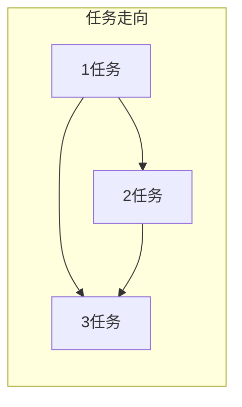
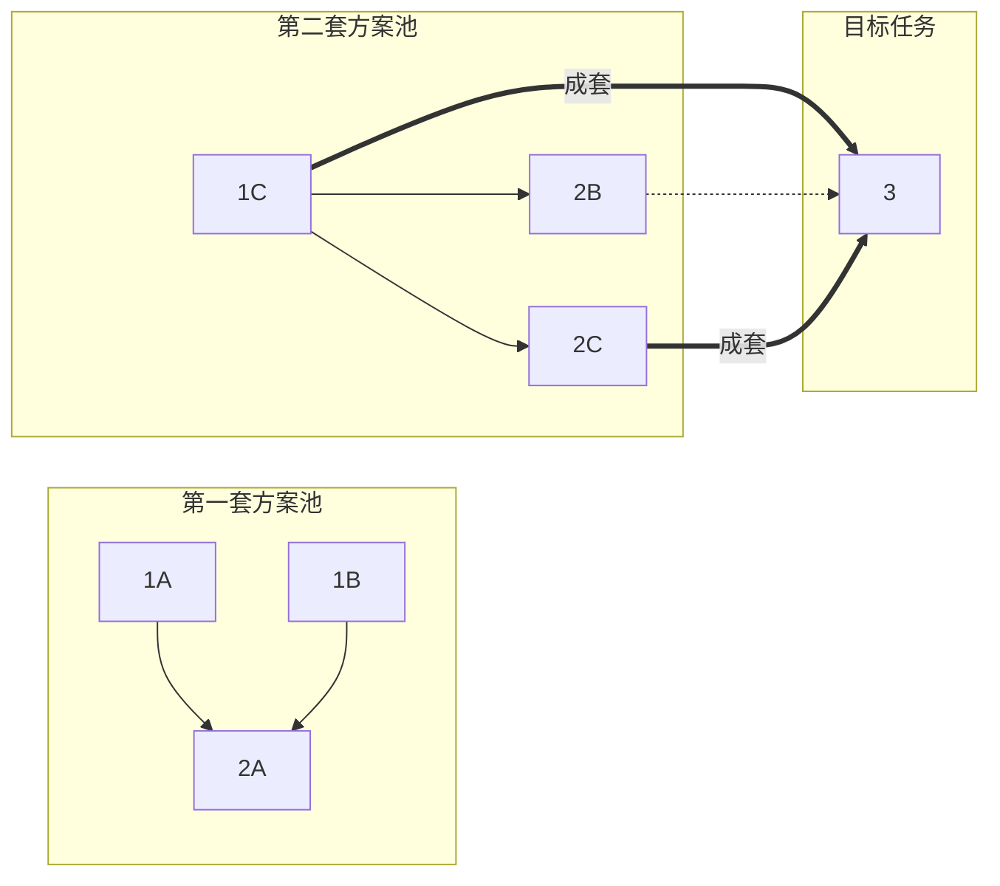
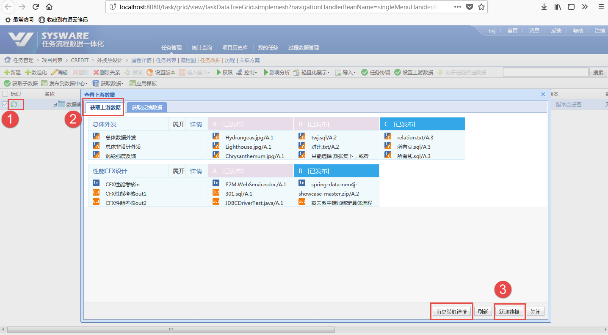
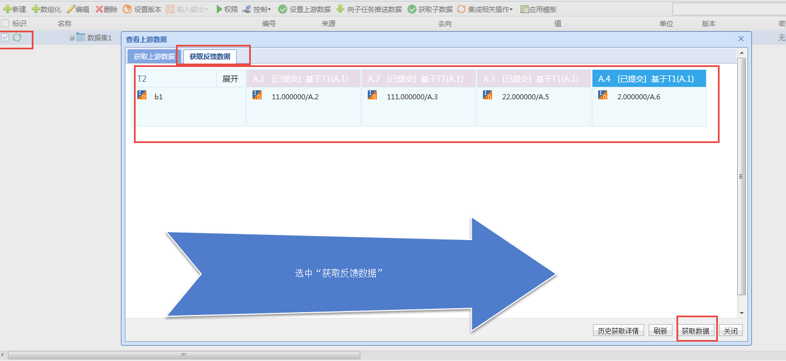
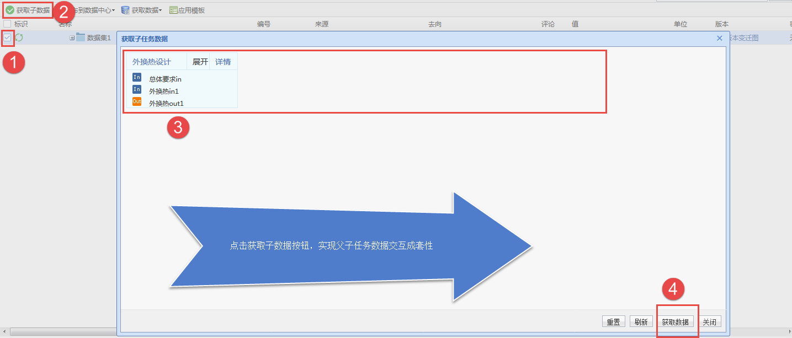
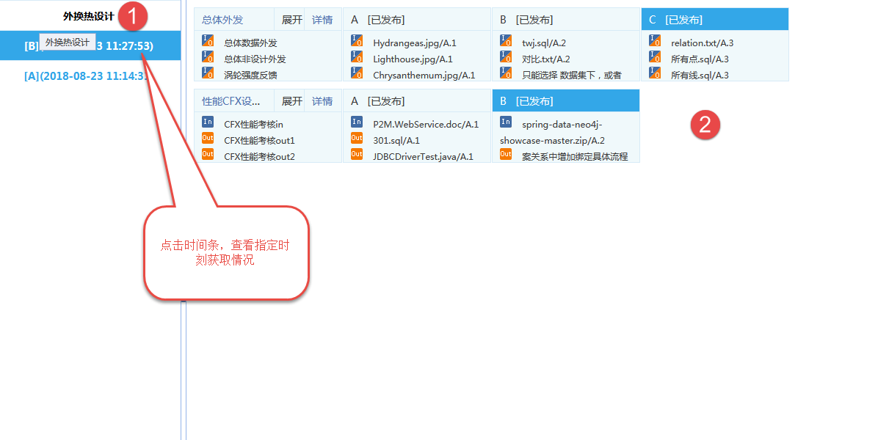

[TOC]


### 前提：

1. 数据集开关 为 [开启]状态。
2. 在一个任务下，只有一个数据集。
3. 数据集，文件夹，数组，参数表等 可以包含 自己点的 数据类型 为 自动升版。
4. 研发模板库版本开关 为 [开启]状态。
5. 有些版本 需要打开成套性开关，但此开关不是我加的，不多做描述。
6. 任务实例化 用 流程模板，活动模板，也可以在活动模板中，引入 数据模板。（PS 也有例外，商发项目没有活动模板）
7. 跨流程的任务需要 点击 [设置上游数据] 按钮，设置跨流程之间的任务之间数据关系。  设置跨流程之间的数据关系 的来源为   [研发活动模板的数据来源]，当然也可以手动新建。
8. 任务流程内的数据关系，来源为 流程模板， 也可手动新建。


### 业务简介：

任务结构实例如下：




  使用方式如下：

```mermaid

sequenceDiagram
    participant 1
    participant 2
    participant 3
    loop 在流程生命周期内，无限循环
  Note left of 1: 1任务的责任人发布了 <br/>A任务的数据集 <br/> 的一个【A】版本
    1->2: 1任务责任人发布一个新的版本发送一条数据集版本变更通知
    1->3: 1任务责任人发布一个新的版本发送一条数据集版本变更通知
    2-->1: 2任务责任人 根据通知，获取上游数据
   Note left of 2: 2任务的责任人发布了 <br/>2任务的数据集 <br/> 的一个【A】版本  
    2->3: B任务责任人发布一个新的版本发送一条数据集版本变更通知
   Note right of 3: 3任务的责任人<br/>根据 1任务，2任务<br/>发送过来的消息<br/>，获取上游 <br/>1任务 | 2任务 的版本  
    3-->1 : 3任务的责任人 获取上游任务1 的数据集版本
    3-->2 : 3任务的责任人 获取上游任务2 的数据集版本
     Note left of 3: 3任务的责任人 <br/> 在同时获取1 与 2<br/>  的数据集版本时，<br/>  需要考虑 1与2的一致关系,此处发生成套性计算
     end
```

成套性实例如下：



当 3 任务获取 1任务 ，2 任务的 数据集版本时， 需要 按照 上图中，实线获取。

### 代码位置

```java
 //java 位置 com.sysware.p2m.data.hookProcess.systematic.SystematicAction

 // jsp p2m/data/systematic/marked/markedDataVersion
```

### 功能分布

1. 获取上游数据成套性

   

2. 反馈数据匹配

   

3. 父任务获取子任务成套性

   

4. 历史获取页面

   ```
   http://localhost:8080/systematic/gotoObtainDataVersionPath.simpleLightmesh?id=20180823105446000803b552203374034326b3e6&UUIDTOKEN=20180823104228000549b0c6034f552b4d5b8f12
   ```

   

5. 大幅度


### 成套性计算内部逻辑：

1. 定位 目标任务 T。 
2. 选出 T 在项目中，所有的上游任务 （递归 穷尽）。
3. 选出 T 的所有上游任务 的历史数据版本中，有关系路径
4. 在3集合的的基础上 , 使用并查集 ， 对数据集传递集合，分组为孤立不相交的集合。
5. 在4 所计算出的集合中，选出 数据集版本最大的集合

### 成套性页面展示逻辑：

1.   展示目标任务 T 的所有 直接上游任务，并且 一个任务 展示一行。
2.   每个任务 右侧展示 数据集的 所有符合状态（"提交"，”共享“，”发布“）版本。 如果上游任务 与 T 不在一个流程内，则只展示 （”发布“）的版本。 

### 成套性界面选取逻辑：

1. 会默认选中 版本值最大一组集合。
2. 一旦选中集合中的一个点，与这个集合没有交集的集合中点，都会被置灰。
3. 连续选中了两个 不匹配的点时，系统会提示是否清空。


### 核心代码


1. 并查集

   

   ```java
   // 参见 com.sysware.p2m.data.hookProcess.systematic.UnionFindSets
   
   	public synchronized void union(T key1, T key2) {
   
   
   		/// 首次加入则存入map中
   		if (!unionMap.containsKey(key1)) {
   			unionMap.put(key1, key1);
   			unionSize.put(key1, 1);
   			count++;
   
   
   		}
   		if (!unionMap.containsKey(key2)) {
   			unionMap.put(key2, key2);
   			unionSize.put(key2, 1);
   			count++;
   
   
   		}
   
   
   		T root1 = find(key1);
   		T root2 = find(key2);
   
   		if (root1.equals(root2)) {
   			/// 如果已经属于同一个并查集，直接返回
   			return;
   		}
   
   			if (unionSize.get(root1) > unionSize.get(root2)) {
   				//// 第一个并查集包含节点多时, 让第二颗树根节点指向第一颗树根节点,并修改对应的并查集大小
   //				if (rootMap.contains(root2)) return;
   				unionMap.put(root2, root1);
   
   				int size = unionSize.get(root1) + unionSize.get(root2);
   				unionSize.put(root1, size);
   
   			}  else {
   
   				unionMap.put(root1, root2);
   				int size = unionSize.get(root1) + unionSize.get(root2);
   				unionSize.put(root2, size);
   			}
   
   
   			count--;//// 总并查集数目减少一
   
   	}
   
   ```

2.  笛卡尔积排布

   ```java
   // 参见 com.sysware.p2m.data.hookProcess.systematic.Descartes
   
   public static void run(List<List<String>> dimvalue, List<String> result, int layer, String curstring)
       {
           //大于一个集合时：
           if (layer < dimvalue.size() - 1)
           {
               //大于一个集合时，第一个集合为空
               if (dimvalue.get(layer).size() == 0)
                   run(dimvalue, result, layer + 1, curstring);
               else
               {
                   for (int i = 0; i < dimvalue.get(layer).size(); i++)
                   {
                       StringBuilder s1 = new StringBuilder();
                       s1.append(curstring);
                       s1.append(dimvalue.get(layer).get(i));
                       s1.append(",");
                       run(dimvalue, result, layer + 1, s1.toString());
                   }
               }
           }
           //只有一个集合时：
           else if (layer == dimvalue.size() - 1)
           {
               //只有一个集合，且集合中没有元素
               if (dimvalue.get(layer).size() == 0)
                   result.add(curstring);
               //只有一个集合，且集合中有元素时：其笛卡尔积就是这个集合元素本身
               else
               {
                   for (int i = 0; i < dimvalue.get(layer).size(); i++)
                   {
                       result.add(curstring + dimvalue.get(layer).get(i));
                   }
               }
           }
       }
   
   
   ```

   

3. js选中 算法

   ```javascript
   <!-- 参见syswareFrameWork\WebRoot\p2m\data\systematic\marked\markedDataVersion.js -->
   
   
   var selectCase = function(currentId){
       //禁用同一个任务分支NODE
   
   
       var disspan = $(".path-versionTitle[data-selectindex!='-1'][data-selectindex!='-2']"+"[taskscope='"+$("#"+currentId).attr("taskscope")+"']");
       disable(disspan);
       var atp = [];
       for(var e=0;e<disspan.length;e++){
           atp.push($(disspan[e]).attr("id"));
       }
   
   
   
       var enableVersions = [];
       atp = _.intersection(atp,selected);
       _.each(allPathes, function (v, i) {
           var ol = v.length;
           var na = _.union(v, atp);
           if (ol == na.length) {
               enableVersions = _.union(enableVersions, v);
           }
           //if (_.indexOf(v,currentId)>-1) {
           //    enableVersions = _.union(enableVersions, v);
           //}
       });
   
       _.each(enableVersions,function(v,i){
           if(_.indexOf(selected,v)<0){
               enable($("#"+v));
           }else{
               select($("#"+v));
           }
       });
   
       //选中当前NODE
       select($("#"+currentId));
       //禁用同级兄弟版本NODE
       disableSiblingNode(currentId);
   
   
   }
   
   ```

   

4. 

   

