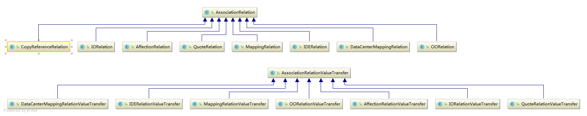

[TOC]


### 数据传递


##### 业务简介

1. 任务A 与 任务 B 之间的数据交互。
2. 任务A 与 流程图中 start ，end ，审核节点，控制节点的 数据交互
3. 任务A 的 数据 与 数据中心 中数据交互。
4. IDE 客户端中的数据 与 任务数据的交互。

前提：

1. 数据集开关是否打开
2. 研发模板版本库开关是否打开
3. 进行数据传递，一定要确认  任务数据 的来源，  任务是否有 研发活动模板/流程模板 实例化

   

   

核心代码：

 

```java
AssociationRelation.java
pm_Association_relation  // 标识 数据与数据之间的关系

//每发生一次传递，就会增加一条 AssociationRelationValueTransfer

AssociationRelationValueTransfer
pm_Association_relation_old
```


```java
//每次映射进行传递时，进行记录；
							MappingRelationValueTransfer mapping = new MappingRelationValueTransfer(src,subTargetData);
							dataService.save(mapping);

```


 数据传递类型 类图



```java
//数据传递一般使用 
MappingRelationValueTransfer  //普通流程内传递 
DataCenterMappingRelationValueTransfer  //数据中心传递
```


##### 代码实例：

```java
// 参见 com.sysware.p2m.data.operation.dataExchange.SetUpPullDataExchange

public Integer compareAndExecDataExchange(String fromId, Long fromRevision, String toId, Long toRevision) {
		Integer foo = 0;
		if(StringUtils.isNotEmpty(fromId)&&StringUtils.isNotEmpty(toId)){
			DataExchange dataExchange = (DataExchange) SystemContext.getBean(MappingDataExchange.BEAN_NAME);
			foo = dataExchange.compareAndExecDataExchange(fromId.trim(), fromRevision+"", toId.trim(), toRevision+"");
			DataObject targetData = P2MServiceLocator.getIDataService().getDataObject(toId.trim());
			if(targetData!=null){
				P2MServiceLocator.getIDataService().update(targetData);
			}
		}
		return foo;
	}

```

```
DefaultDataExchange.swappDataObjectOld
```


##### 数组传递

1. IDE 每次同步任务数据时，对于数据选型，会比较 数组的 长度，维度，如果与IDE 不一致，会同步失败。
2. 上游任务与下游任务之间的 数组维度不同，不能进行传递。
3. 维度相同时 ， 按照原数组，与 目标数组的下标，进行 映射覆盖。

```java
// 参见 DefaultDataExchange.swappDataObjectOld


```

