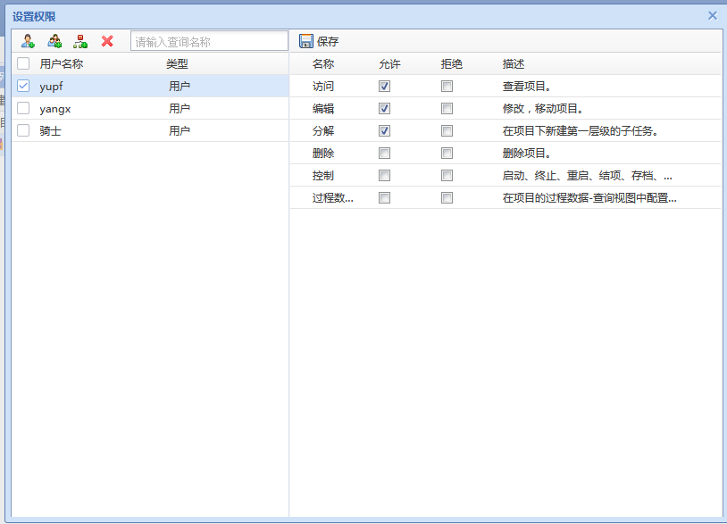
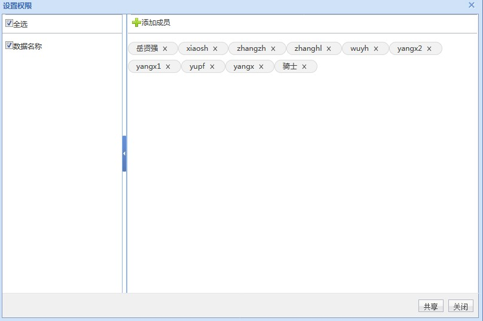

# 数据权限 #


### P2M第一种入口 ###


代码示例：

```javascript
	var setWindow = $.sywWindow.show({
        "title": "设置权限",
        "width": 800,
        "height": 580,
        "url": basePath+'/data/operation/allocationDataPrivilege.action',
        "params": {dataId: taskId, dataType: 'TaskObject'},
        "useMask": true
    });
```

url ：

```javascript
basePath+'/data/operation/allocationDataPrivilege.action
```

对IDE 提供url：
    
```javascript
basePath+'/data/operation/allocationDataPrivilege.simpleLightmesh
```

param ：

    dataId ： 数据ID  任务 | 数据 | 工程模板 | 菜单节点
    
    dataType : 数据类型 sys_privilege_operation operation_Type


​    

效果：




### P2M第二种入口 ###

说明：此种入口只能展示传入的 privilegeCode 

代码示例：

```javascript
 SetDataPrivilegeWindow({
            limitId: "",
            dataId: "数据ID 可以批量",
            dataName: "数据名称  可以批量",
            dataType: "权限类型",
            operationCode: "list",
            callback: function () {
               //TODO : 
            },
            closeCallBack: function () {
				//TODO : 
            },
            buttonText: "共享"
        });
```

 


前提：

    在jsp页面中要引入 根目录 下 /p2m/data/allocation2/js/SetDataPrivilegeWindow.js


参数说明：

```javascript
		{
            limitId: 要排除的人员ID,
            dataId: 数据ID 可以批量,
            dataName: 数据名称  可以批量,
            dataType: 权限类型,
            operationCode: 要默认实现的权限code,
            callback: function () {
               //TODO : 点击保存后事件
            },
            closeCallBack: function () {
				//TODO : 关闭窗口后事件
            },
            buttonText: "共享"
        }
```


使用效果：




url ：

```javascript
data/operation/setNewDataPrivilege.simpleLightmesh

参数 ：
 
opeType=TDE

limitId = 

dataType= 

operationCode = 

dataId = 

dataName =  
```
