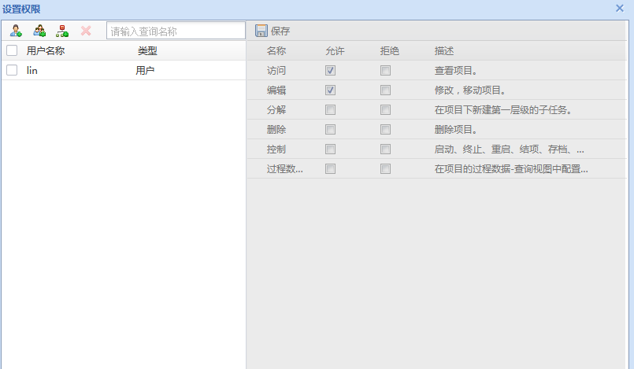

# 数据权限存储原理 #

### 操作权限分类 ###

    如下表结构 为 SYS_PRIVILEGE_OPERATION 的字段内容

| 字段	   |描述      |
| -------------|-------------|
| DATA_TYPE	   |数据类型      |
| OPERATION_CODE|			操作码 |
| PRIVILEGE_CODE|			权限码，按照系统设计同一数据类型只能为[1-63]的整数。|
| OPERATION_NAME|				操作名称|
| FRONT_OPERATION_CODE|			前置操作码，如果无前置操作置为0。|
| ROW_SORT_ORDER|		同数据类型类型排序|
| DESCRIPTION|	

   在系统中，基于 统一的数据字典，内置了很多对象类型 例如 任务，数据 ， 分类夹。

   但基于每一种对象类型的权限操作，都在SYS_PRIVILEGE_OPERATION 中有一套对应的存储。

   例如： TaskObject 对应 系统中的 项目 / 任务。

|DATA_TYPE                                |OPERATION_CODE                           |PRIVILEGE_CODE |OPERATION_NAME                                                                   |FRONT_OPERATION_CODE                     |ROW_SORT_ORDER |DESCRIPTION
|---------------------------------------- |---------------------------------------- |-------------- |-------------------------------------------------------------------------------- |---------------------------------------- |-------------- |--------------------------------------------------------------------------------
|TaskObject                               |control                                  |             4 |控制                                                                             |visit                                    |             5 |启动、终止、重启、结项、存档、设置权限。
|TaskObject                               |createSubTask                            |             6 |分解                                                                             |visit                                    |             3 |在项目下新建第一层级的子任务。
|TaskObject                               |dataViewConfig                           |             5 |过程数据查询视图配置                                                             |visit                                    |             6 |在项目的过程数据-查询视图中配置查询结构。
|TaskObject                               |delete                                   |             3 |删除                                                                             |visit                                    |             4 |删除项目。
|TaskObject                               |edit                                     |             2 |编辑                                                                             |visit                                    |             2 |修改，移动项目。
|TaskObject                               |visit                                    |             1 |访问                                                                             |0                                        |             1 |查看项目。
   
    		

在上图中， 会发现Operation_code 分为若干类，每一类都对应 privilege_code , 这个code 对应 operation_definition_task.xml 文件中 一个 operation 配置段中的 value 属性

    <operation id="task/operation/deleteStructure" name="删除结构树" value="2" idProperty="id"> 
   	 	<around-event> 
      		<bean>deleteStructure</bean> 
    	</around-event> 
	</operation> 

 如 value = 2 ，则代表 该操作受控于 TaskObject 的 `operation_code=2` 的 edit 权限。

 如图1：
只要勾选了，编辑项，则意味着对value=2 的operation 有操作权限。

同时在数据库中会增加一条记录。如下表

|PRIVILEGE_ID	|6E81B09F262F0993E053C805A8C03E73|
| -------------|----------------------|
|USER_GROUP_TYPE|	0|
|USER_GROUP_ID|	27015d26913a47a393edf80142e89339_lin|
|DATA_TYPE|	TaskObject|
|DATA_ID|	20180613151120000257b90a2f15b54746d9a9f7|
|ALLOW_VALUE|	6|
|REFUSE_VALUE|	0|
|ROW_SORTER	|1|
|USER_GROUP_NAME|	lin|

在表中 allow_value = 6 ,则代表 当前人员 有 有访问，编辑权限。存储在表中时，则替换为 2 * 【权限的所对应的operation_code 】的综合，例如 lin 有 访问，编辑权限 ，对应的值未  1*2 + 2*2 = 6 

### 判断一个用户是否对 数据有权限 ###
 通过如下sql 即可判断 一个用户 对 数据有哪些权限。

    
	with ps as
	 (select *
	    from sys_data_privilege t
	   where t.data_id = '20180613151120000257b90a2f15b54746d9a9f7'
	     and t.data_type = 'TaskObject'
	     and t.user_group_id = '27015d26913a47a393edf80142e89339_lin'
	     and t.user_group_type = '0')
	SELECT (SELECT DATA_Id FROM PS) dataid,TC.* FROM (
	select p.operation_code,
	       bitand((select allow_value from ps), power(2,p.privilege_code)) A,
	       power(2,p.privilege_code) B
	  from sys_privilege_operation p
	 where p.data_type = 'TaskObject') TC WHERE TC.A = TC.B
	

 原理： 即将 `sys_data_privilege`存储的allowvalue 与 `privilege_code`对应的 2指数值，进行按位与运算，如果 `bitand((select allow_value from ps), power(2,p.privilege_code))=power(2,p.privilege_code) ` 即有权限

   

