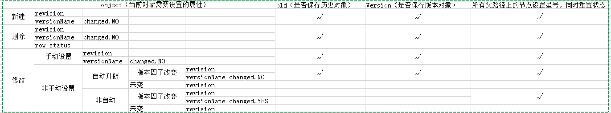

[TOC]

### 历史记录

```sql
pm_data_object -- 存储任务数据 
pm_data_object_old --存储任务数据历史版本
```

```xml
<!-- 项目下 model_mapping_*.xml 约定了  P2M 增加历史记录的实体对应关系 -->
<mapping original="com.sysware.p2m.data.entity.DataObject" old="com.sysware.p2m.data.entity.DataObjectOld"/>  

<mapping original="com.sysware.p2m.data.entity.relation.structure.StructureRelation" old="com.sysware.p2m.data.entity.relation.structure.StructureRelationOld"/>

```


当符合 版本因子与升版规则时， 会向历史表 增加一条 当前表的 拷贝。


### 版本因子

详见 【配置工具】 中 【项目、任务、流程、数据一体化】【模型配置】 


传统意义上 ， 一个数据模型  的 value 属性 ， unit 属性 一般会做为 版本因子。

也有一些例外：

1. 文件夹类 模型： 例如 数据集，文件夹，参数表等 一般没有版本因子
2. 数组类型 ： 一般会将 长度,维度设为版本因子
3. 文件类型，参数类型 ： 一般会将 值 ，单位设为版本因子。
4. 由于一些特殊需要，来自数据字典的  阶段，专业可能也会是 版本因子 。


### 是否自动升版

如上题中，示例操作图中，可以在 一个数据模型中的基本属性页，看到 数据模型是否自动升版。


一般来说：

1. 文件夹类 模型： 例如 数据集，文件夹等 是 手动升版的。
2. 数组类型 ： 是手动升版的。
3. 文件类型： 是自动升版的。
4. 


### 历史记录的版本命名规则


在P2M 中默认的版本 命名规则 一般为如下，可参见 

```mermaid
graph TD;
subgraph 1*n ,最大到 ZZZZZZ 
subgraph 版本变迁规则
1("A.0  默认生成") ==> 2("A.1 小版本") 
 2("A.1 小版本") ==1*n==> 3("A.n 小版本")
end

subgraph 版本变迁规则1
4("B  大版本") ==> 5("B.1 小版本") 
5("B.1 小版本") ==1*n==> 6("B.n 小版本")
end
3("A.n 小版本") ==大版本==> 4("B  大版本")
end
```


### 版本生成判断条件


一般来说 ，要在 版本因子是否发生变化， 自动升版，与 手动升版本  三要素决定下，才能升版。




### 注意事项

1. 一般如果将 一个文件类型 设置为 手动升版， 那么编辑 文件本身会有*号，除非手动设版本。否则一直不会升版本。
2. 文件夹类 数据 ，一般为 手动升版， 一般为 子类型自动升版后，人工手动设置版本。


### 查看某条任务数据的版本内容

1. 在 p2m 任务数据里， 每一级数据都有自身版本。
2. 在某一时刻，一条数据版本是 包含 当前数据的版本与所有子数据的版本。
3. 展示数据集版本，是要确保 子元素的版次 小于 数据的版次


```sql
  SELECT O.*
    FROM (SELECT DENSE_RANK ()
                    OVER (PARTITION BY D.ID ORDER BY D.revision DESC)
                    cn,
                 D.ID,
                 D.REVISION,
                 D.ROWSTATUSID,
                 s.sortorder,
                 s.rowstatusid relationStatusId
            FROM PM_DATA_OBJECT_OLD D
                 LEFT JOIN PM_STRUCTURE_RELATION_OLD S ON D.ID = S.CHILDID
           WHERE S.PARENTID = :id AND D.REVISION <= :revision) ETC
         LEFT JOIN PM_DATA_OBJECT_OLD O
            ON ETC.ID = O.ID AND ETC.REVISION = O.REVISION
   WHERE ETC.CN = 1 AND ETC.ROWSTATUSID = 0 AND ETC.relationStatusId = 0
ORDER BY etc.sortorder
```

根据以上sql ，设置 id ，revision 就可获取到版本详情。